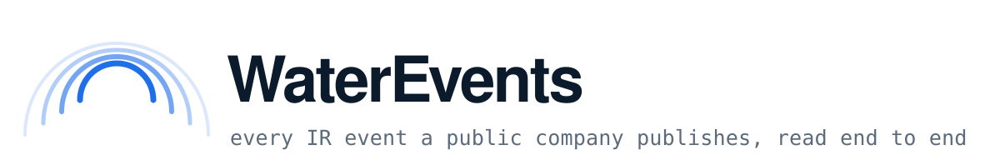

<p align="center">
  <picture>
    <source media="(prefers-color-scheme: dark)" srcset="docs/banner-dark.svg">
    
  </picture>
</p>

<p align="center">
  
  
  
  
  
</p>

WaterEvents finds every investor-relations event a public company publishes — earnings calls, press releases, filings, conferences — and then reads the documents behind each one.

Give it a company. It opens the company's IR site in a real browser, sends each page's text **and a full-page screenshot** to a vision-language model in one call, and gets back two things: the events on that page, and the links worth going deeper on. Events are leaves. Links go back into the frontier. It loops until the frontier is dry. A second pipeline then opens whatever each event points at — a PDF, an XLS deck, a webcast, an earnings call recording — and turns it into rows. The production database holds **255,608 events**.

<p align="center">
  <a href="#quick-start">Quick start</a> ·
  <a href="#how-it-fits-together">Architecture</a> ·
  <a href="#the-scheduler-solves-for-its-own-period">The scheduler</a> ·
  <a href="#evaluation">Evaluation</a> ·
  <a href="#four-bugs-worth-reading-the-commits-for">Bugs worth reading</a>
</p>

## Install

```bash
git clone https://github.com/yongzhe-wang/WaterEvents.git
cd WaterEvents
python3 -m venv .venv && source .venv/bin/activate
pip install -r backend/requirements.txt
playwright install chromium        # default render path
patchright install chromium        # stealth fallback tier
python -m camoufox fetch           # hardest-wall tier (Akamai / Incapsula)
```

Three external services are required: a Postgres database, a browser render host, and an OpenAI-compatible vision-language endpoint (this runs Qwen-VL on vLLM).

```bash
cp backend/deploy/waterevents.env.example ~/.waterevents.env
$EDITOR ~/.waterevents.env          # every variable is documented in place
source ~/.waterevents.env
```

`waterevents.env.example` is worth reading before you fill it in. Each tuned value carries the measurement that produced it and what breaks if you move it — the text cap is not a round number, and neither is the page cap.

## Quick start

Apply the schema, then start the three processes. They are independent: restarting any one does not disturb the other two.

```bash
supabase db push --db-url "$WATEREVENTS_DB_DSN"
```

```bash
# 1. the crawl fleet — N workers, one pinned core each, draining the work queue
N=6 bash backend/deploy/launch_fleet.sh
```

```bash
# 2. the pacer — re-solves the scan period every hour and re-spaces the queue
bash backend/deploy/launch_pacer.sh
```

```bash
# 3. the public read-only API on :8090
PORT=8090 bash backend/deploy/launch_api_service.sh
```

```bash
curl localhost:8090/today/pulse
```

On a non-default host, all three take `EVENTINC_HOME` and `EVENTINC_PY`:

```bash
EVENTINC_PY=~/venv/bin/python EVENTINC_HOME=~/WaterEvents N=6 \
  bash backend/deploy/launch_fleet.sh
```

## How it fits together

```
                    ┌──────────────┐
   company  ──────▶ │ ir_url_agent │  render home page · harvest nav links ·
                    └──────┬───────┘  SERP fallback · VLM-classify → event hubs
                           │
                           ▼
                    ┌──────────────┐
                    │  event_agent │  close-loop BFS
                    │    /crawl    │  render + shot → VLM → {events, routes}
                    └──────┬───────┘  routes re-enter the frontier; events are leaves
                           │
                           ▼
                    ┌──────────────┐
                    │  media_agent │  one handler per kind:
                    │              │  html · pdf · xlsx · docx · pptx · audio · video
                    └──────┬───────┘  Docling for office, faster-whisper for audio
                           │
                           ▼
                     Postgres (Supabase)
                           │
                    ┌──────┴───────┐
                    │ api_service  │  read-only, on a separate connection pool
                    └──────────────┘
```

**`providers/watercrawl`** is the browser layer: lifecycle, page factory, in-page extraction JS, politeness queue, wall detection, and a three-tier render fallback. **`agent/event_agent/scheduler`** is the control plane. **`api_service`** is a standalone aiohttp process that reads through PostgREST instead of opening its own Postgres pool, so hammering the public endpoint cannot starve the crawl fleet — the two pools show up as distinct roles in `pg_stat_activity`.

## Why this is harder than it looks

Three problems, and most of the code is about them.

**The links are not in the HTML.** A typical IR site puts *Events & Presentations* inside a JavaScript mega-menu. It is visibly on the page and it is not an `<a href>` in the source. So every page goes through a real browser and extraction runs against the rendered DOM. Across a 100-company benchmark, the correct events page was sitting in the rendered home-page navigation for 95 of them.

**The page is a layout, not a document.** Dates are in one column, titles in another, and the event type is often carried by an icon. Text alone destroys this, so every call sends inline text and a screenshot together — which is what makes the context budget tight:

| | tokens |
|---|---:|
| screenshot (client pixel-bounds it) | ~1,500 |
| inline text (24,000 char cap) | ~7,000 |
| system | ~1,000 |
| output | ≤ 8,000 |
| **total** | **~17,500** of 32,768 |

Setting that character cap to 8,000 was catastrophic. Normal pages got pushed into the chunking path, and the chunking path drops the screenshot — the model then collects junk navigation links and under-extracts. The cap is a measured value.

**Some hosts will not talk to a data center.** IR pages served by Q4 Inc. and gcs-web.com read-timeout from cloud egress. The renderer escalates through direct render → residential proxy → stealth browser, with a wall detector deciding when. With the residential tier unarmed, those companies return zero events forever and nothing in the logs says why.

## The scheduler solves for its own period

Two resources bottleneck the fleet: browser render capacity and VLM capacity. Every company gets a full sweep weekly; hub pages get an incremental sweep as often as leftover capacity allows.

Run the incremental sweep too often and it starves the full sweep. Too rarely and expensive GPU capacity idles. So the period is not configured — it is solved. Every hour the pacer reads live capacity and measured per-unit cost, and for each resource solves:

```
full_demand + (168 / T) · incremental_demand_per_round  =  capacity · 168
```

It takes the larger root — the binding resource — as `T*`, then re-spaces every queued job's `due_at` evenly across `[now, now + T*]`. The full sweep backfills whatever capacity is left. Change the capacity profile and the next solve produces a new `T*` by itself.

The cold-start constant for this used to be 40 pages per company. Measured reality: mean 5.2, median 5, p90 10, max 26 — not one company reached 40. At 40 the solver declared the full sweep infeasible and refused to schedule it at all.

## Evaluation

Two datasets, both stratified by **what breaks**, not by population share.

**`tests/datasets/media_100`** — 100 real events chosen so every handler branch runs a dozen-plus times. Sampling by true proportion would have yielded 0 pptx, 0 docx and about 1 video, which are precisely the three branches most likely to be broken and least likely to have been exercised.

**`tests/datasets/edge_200`** — 200 events drawn from 240,707, split by whether a machine can grade the answer:

| stratum | n | how it is graded |
|---|---:|---|
| `auto_verifiable` | 100 | press release containing `(NYSE: HCA)` — the ticker **is** the ground truth |
| `hard_no_tag` | 60 | no ticker: private entities, subsidiaries, foreign issuers — read by hand |
| `other_types` | 25 | earnings · filings · conferences · dividends — read by hand |
| `expect_no_edge` | 15 | pure scheduling entries that should yield nothing |

The first stratum is the useful trick. When a release names its own exchange ticker inline, the correct extraction is objectively determined and free to check — which makes it the only unbiased ruler available while tuning a prompt.

```bash
MEDIA_RUN_DATASET=tests/datasets/media_100 MEDIA_RUN_OUT=tests/media_output \
  python3 tests/media/media_run.py
```

## Four bugs worth reading the commits for

Each was a plausible wrong answer that survived until somebody measured.

**The ceiling was `asyncio`'s default thread pool.** Throughput was capped and no configured limit explained it. The real bound was the default executor's thread count — and when the machine was downsized it silently dropped from 20 to 12, so the ceiling moved and nothing reported that it had.

**98% of a fetch slot was spent asleep.** Slots were claimed *before* waiting in the politeness queue. Concurrency looked saturated; nearly all of that occupancy was threads sleeping. The metric was measuring patience, not work.

**The fair gateway locked itself.** Under full rejection it shed rate, which caused more rejection, which shed more rate. Idle time now halts the shedding, breaking the loop.

**Every redirect chain leaked a handle.** The curl handle was never closed. Wrapping the chain in a `Session` fixed a leak present since the first commit.

## Repository layout

```
backend/
  agent/
    ir_url_agent/     company → its IR event hub pages
    event_agent/      crawl · scheduler + pacer · storage · title backfill
    media_agent/      extract · pipeline handlers · storage
  providers/
    watercrawl/       browser render, politeness, wall detection, 3-tier fallback
    qwen_llm/         VLM client (OpenAI-compatible, guided JSON)
    webshare/         residential proxy channel
  api_service/        public read-only HTTP surface
  tools/              officeall (Docling) · audio_extract (faster-whisper) · youtube
  supabase/           migrations
frontend/             dashboard (React + Vite)
tests/                datasets, harnesses, ops reports
```

Roughly 27,000 lines across 163 commits.

## A note on the comments

Module and function docstrings are bilingual, and non-obvious constants carry the evidence they came from:

```python
# {MEASURED 2026-07-28 pg_stat_activity "postgres/Supavisor 7 idle + 1 active (fleet)
#  vs authenticator/PostgREST 5 idle"}
# [CONFIDENCE: CONFIRMED 100% — the two pools are distinct usename sets]
```

Every tuned constant here can be traced to the measurement that produced it. That convention is why the four bugs above were findable: when a number carries its provenance, a number that no longer matches reality announces itself.
